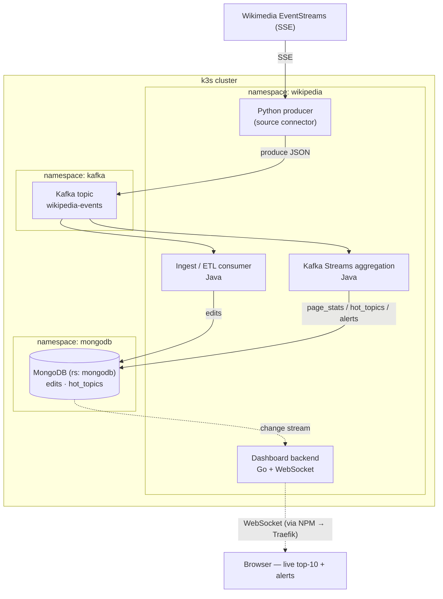

# wikipedia-edit-stream

This project sources [wikipedia event stream](https://wikitech.wikimedia.org/wiki/Event_Platform/EventStreams_HTTP_Service) edits and creates a real time 10 top dashboard for `hot` topics.  




# Hotness Scoring

Everything is in **editor-units**: one distinct editor = 1 point. Additional scoring is normalized on this unit

```
EXCLUDE if  bytesChanged == 0  AND  distinctEditors <= 2  AND  editCount >= 2   (rollback)

hotness = distinctEditors                                  ← linear, uncapped (diversity dominates)
        + 2.0 × min(1, ln(1 + editCount)      / ln(1 + S)) ← edit volume:  sub-linear, cap 2
        + 1.0 × min(1, ln(1 + |bytesChanged|) / ln(1 + B)) ← byte change:  sub-linear, cap 1
```

- `S` = **edit-saturation** (default 10): editCount at which the +2 bonus maxes out.
- `B` = **byte-saturation** (default 2000): `|net bytes|` at which the +1 bonus maxes out.
- Both are ConfigMap knobs (`HOTNESS_EDIT_SATURATION`, `HOTNESS_BYTE_SATURATION`).

## Design rationale

- **Distinct editors dominate** → linear and *uncapped*. Nothing else grows without bound, so breadth of participation always wins eventually.
- **Raw edits sub-linearised (ln) and capped at 2** → a prolific single editor / bot can't buy rank with volume; the 50th edit barely moves the needle.
- **Byte change is a tiebreaker, capped at 1** → rewards substantial content change without dominating. Uses `|net bytes|` (abs of the signed sum), *not* churn — so an edit war's back-and-forth earns no credit.
- **Single-editor ceiling = 4.0** (`1 self + 2 edit-cap + 1 byte-cap`) = four distinct editors' worth. Any page with 5+ distinct editors always outranks any single-editor page.

Excluded pages score 0 and are **removed** from the top-N (`TopN.merge` drops score ≤ 0).

## Worked examples (S = 10, B = 2000)

| edits | editors      | net bytes | hotness                          |
| ----- | ------------ | --------- | -------------------------------- |
| 3     | 1 (same)     | +300      | 2.91                             |
| 2     | 2 (distinct) | +400      | **3.71**                         |
| 2     | 2 (distinct) | 0         | *excluded*                       |
| 10    | 1 (same)     | +1000     | 3.91                             |
| 50    | 1 (same)     | +5000     | **4.00** ← single-editor ceiling |
| 3     | 3 (distinct) | +200      | 4.85                             |
| 5     | 5 (distinct) | +1500     | 7.46                             |

